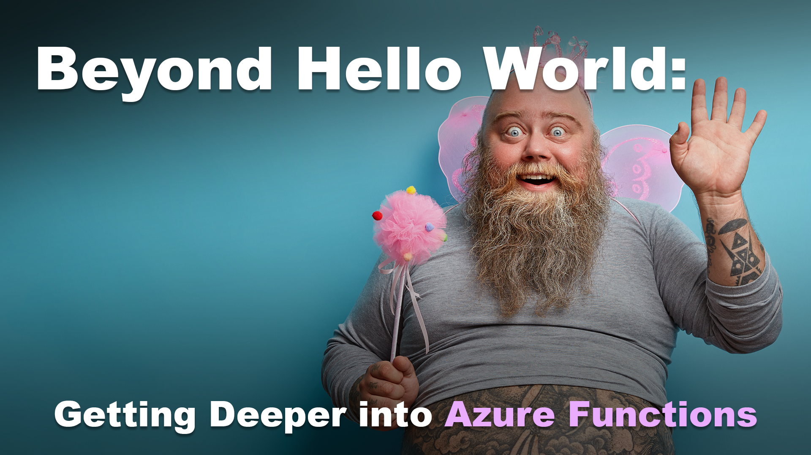

# Beyond Hello World: Getting Deeper into Azure Functions

## Elevator Pitch
There is more to Azure Functions than just the HTTP trigger; come to see real-world examples of the different types of triggers and bindings.

## Abstract
You surely have seen the HTTP trigger within Azure Functions. Every presentation uses that trigger to show how awesome Azure Functions can be. But there is a bunch more you can do with Azure Functions using the other triggers and bindings, which makes Azure Functions a fantastic tool in your tool chest for solving all sorts of needs. So come and hear about these triggers and bindings and see real-world examples of how they have been employed in different solutions to solve real customer needs.

# Type
- 45/60/75-minute session

## Tags
- .NET
- Architecture
- Azure
- Azure Functions
- C#
- Cloud
- Cloud-Native
- Cloud-Native Architectures
- Integrations
- Serverless

## Learning Objectives
- Learn about the different Azure Function bindings and triggers outside of the HTTP trigger.
- See real-world examples of how Azure Functions have been used to solve real needs.
- Learn how to use the Durable Functions extension to build orchestration processes that extend Azure Functions beyond your imagination.

## Presentations

| Event | Location | Date | Time | Room | Downloads |
|-------|:--------:|-----:|-----:|-----:|----------:|
| [Tech Bash 2024](https://www.techbash.com/) | Pocono Manor, PA | September 25, 2024 | 10:20 AM EDT | Salons EF | Available Afterwards |
| Beer City Code | Grand Rapids, MI | August 5, 2023 | 4:00 PM EDT | Room 255 | [Slides](./EventMaterials/BeyondHelloWorld_GettingDeeperIntoAzureFunctions-BeerCityCode.pdf)|
| Prairie Dev Con Winnipeg | Winnipeg, MB | June 12, 2023 | 11:00 AM CDT | A2 | [Slides](./EventMaterials/BeyondHelloWorld_GettingDeeperIntoAzureFunctions-PDCWinnipeg.pdf) |

Email [chadgreen@chadgreen.com](mailto:chadgreen@chadgreen.com?subject=Presentation%20Request:%20Getting%20Deeper%20Into%20Azure%20Functions) to have Chad present this session at your event.

## Resources

There are no additional resources for this presentation.
